## Introduction

I've always been fascinated by the world around us, and the many ways we try to
understand it. There are multiple manners we can experience or describe it, from
the formal and rigorous methods of math and physics to the more creative art of
photography and painting. In recent years, we saw a massive improvement in the
technology we have at hand, in particular algorithms and computation power. A
natural question may arise: *how can we introduce this technology in the loop
and use it to observe and assist the planet we are living on?*

This article is the first in a series documenting my journey in exploring the
Earth with modern observation techniques, where I learn and share how we can
leverage algorithms, math, and new technologies to help us better understand our
environment.

Among the many applications in this field, I've chosen to focus on detecting
**wildfires** using satellite data. The European Forest Fires Information System
(EFFIS) published data highlighting how the average area affected by fires in
2025 in European Union member states was more than double the average across
2006-2024. The Mediterranean region is the one that got more impacted by this
phenomenon, which has drastic effects and consequences not only on the impacted
areas, but on the overall natural equilibrium, with side effects both on the
society and economy. When biomass burn, a lot of components with short and long
term impact on human health and environment are released, like black carbon and
nitrogen oxides.


As a case study, we will investigate the Achaia-Ilia wildfire happened in Greece
during June 2024. I hope you will enjoy reading this post as much as I enjoyed
learning the concepts behind it. If you are interested in the backend, you can
find all the code used to perform the described analysis shared open-source in
the associated [repository](https://github.com/0xstepit/burn-area-detection).
Feel free to contribute if you have recommendations or improvements!

## GIS and Satellites

Applications for Earth Observation (EO) use Geographic Information Systems (GIS)
to associate analyzed data with specific geospatial information. These systems
are of paramount importance because allow to monitor what is happening on the
Earth surface or atmosphere by leveraging remote sensing instruments. Data
acquired this way is usually provided in the form of digital images, which in a
computer are represented by a matrix of numbers, usually with three dimensions,
two for the horizontal and vertical directions, and on for the properties
measured in each pixel.

Observations of the Earth are done in different ways, but the most common one is
through satellites in close orbits around us. Acquisition of the images can be
obtained in two ways:

- **Passive imagery**: this approach is based on the observation of the
  electromagnetic emissions of the Earth's surface and the atmosphere. These
  emissions are mainly due to reflection of the sunlight or internal production
  from vegetation.
- **Active imagery**: this approach is based on systems composed of a
  transmitter that sends a specific signal to the Earth and a sensor that
  receives information of the interaction of the signal with the surface. The
  time between the signal sent and the one returned, and the intensity, are used
  to evaluate the measured properties.

In the context of burn area detection, we will focus on the usage of passive
imagery obtained with multi-spectral optical instruments. Without going too much
into detail here, it is important to know what is the electromagnetic (EM)
spectrum and the radiation.

The electromagnetic radiation (EMR) is a form of energy, like the gravitational
one, that propagates as waves traveling through space. These waves are what
constitute the electromagnetic field. Although we don't see these waves like we
do in the ocean, for example, they are constantly present around us, with the
Sun being the primary source.

The EMR is associated with energy which is characterized by its frequency. The
frequency is measured in Hertz ($Hz = \frac{1}{s}$) and allows us to create the
electromagnetic spectrum by classifying radiation into different regions, the
**bands**. The colours we see around us are just a small part of the entire
spectrum.

The multi-spectral instrument allows to collect imagery containing a combination
of bands that creates composite images. Based on how these images are composed,
we can perform different types of analysis. We can for example use them to
highlight specific features or patterns, like recently flared up fires or
healthy vegetation.

The **reflectance** of the objects is what allows us to study the surface of our
planet. It is defined as the fraction of the incident electromagnetic power that
is reflected by the object and the one that reaches the body. Remote sensing
techniques work by observing what is reflected by the Earth's surface. Please,
refer to the article about
[spectral signatures](../remote-sensing-fundamentals-from-light-to-spectral-signatures/)

## Sentinel-2

For our investigation we will use the data provided by the European Space Agency
(ESA) Sentinel-2 mission, which are kindly accessible for free. Data can be
accessed in different way, and in our case, we will use the **Copernicus Data
Space Ecosystem (CDSE)**.

Before diving into the analysis, it is useful to learn some concept about
satellite imagery acquisition that have a direct impact on the data processing.

The **swath** of a satellite is the strip on the ground the satellite is able to
acquire images from during its orbit. Higher is the swath width and higher is
the portion on the ground we can observe with a pass of the satellite. This
parameter tends to be inversely proportional with the resolution. But what is
the resolution?

- **Spatial resolution**: one way to assess it is by computing the difference in
  space between adjacent pixel center on the ground. Very high resolution
  systems provide a spatial resolution below 5m.
- **Spectral resolution**: is the analogous of the previous one but for the EMS.

Each satellite in the Sentinel-2 mission carries as a payload a Multi-Spectral
Instrument (MSI) capable of sampling 13 bands in the EMS and have a swath width
of 290 km. The spatial resolution which depends on the spectral band, and
combining data of bands with different resolution requires proper resampling
operations. For our analysis we will only work with bands sampled at 10 and 20 m
of resolution:

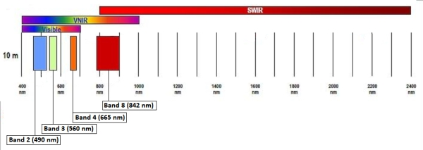


In particular, we will consider:

- Band 2,3, and 4 at 10m to generate the RGB image and combine the red band for
  an spectral index.
- Band 8 at 10m for the near infrared.
- Band 8a at 20m for the near infrared.
- Band 12 at 20m for the shortwave infrared.

In the 20m spatial resolution we are using the SWIR at band 12 and not 11
because it should be better correlated with burn severity measure.

What we are interested in from the products offered for the Sentinel-2 is called
granule, or also commonly referred to as **tile**. A tile is a snapshot for all
the spectral bands with a spatial dimension of
$110 \: \text{km} \times 110 \: \text{km}$. These tiles are represented using
the **Universal Transversal Mercator (UTM)** reference system to project
geographic coordinate in the sphere to a plane reference system where we can
compute distances. Within this system, the Earth's surface is divided in
different regions like visible in the picture below:

")

Within this system we can easily identify a specific geographic area with an
identifier.

## Download data from Copernicus

The most direct approach to get Sentinel-2 data is through the
[Copernicus browser](https://browser.dataspace.copernicus.eu/?zoom=5&lat=50.16282&lng=20.78613&themeId=DEFAULT-THEME&demSource3D=%22MAPZEN%22&cloudCoverage=30&dateMode=SINGLE).
If you are new to EO like me, it will not be very intuitive how to use the
website, but I do believe it is very informative and useful to play around with
the manual download of the data before leveraging their API. If you like you can
also understand how to use the Copernicus Browser by watching the
[videos](https://www.youtube.com/@copernicusdataspaceecosystem) shared on their
YouTube channel.

The tile I selected is associated with the identifier:

`S2A_MSIL2A_20260409T101051_N0512_R022_T33UVU_20260409T170912`

You can copy paste this string into the **Search Criteria** and then press
**Search** to view the scene associated with it.


If you are interested in understanding what this ID means, please refer to the
[S2 products] web page, but in simple terms it is nothing but a unique
identifier in space, time, and boundary condition a tile. The only other
interesting thing to mention here, is that the part `T33UVU` indicates the
specific tile we want, and you can find its position in the tiling system
picture by looking for the `33U` rectangle.

When dealing with Satellite imagery, product is the term associated with data at
a specific level of processing. In our case, we will use the 2A product because
provides images with atmospheric correction already applied, the so called
Bottom of Atmosphere (BOA). Images at Top of Atmosphere (TOA) are provided with
the 1C product but contains more noise that we would have to manually clear.

From the left side you download the zip file containing all the data associated
with this scene. Unzipping the file will give you a `.SAFE` folder, which stands
for Standard Archive Format for Europe. You can then find all the band images
represented with the `.jp2` format which is the newer standard for the old
`.jpg`, designed specifically to support georeferencing data.

A better alternative for downloading data is via API. In this context, the
industry maturated creating a common standard to store and provide geospatial
information, and this standard is the
[SpatioTemporal Asset Catalog (STAC)][stac]. In this system, we refer to a
specific asset, like a band, as an item. An item is stored in the standard
[GeoJSON] format.

## Spectral indexes

We mentioned that the Red band data will be used to compute an index for the
analysis, but what does this mean? When we have access to spectral data, we have
the possibility to observe characteristic of the observed objects that are far
beyond what we can see with our eyes. Spectral indexes are combinations of
spectral bands designed to highlights specific objects or characteristics on the
ground.

### The normalized difference vegetation index

The **Normalized Difference Vegetation Index (NDVI)** is a metric used to
quantify the health and density of vegetation using two electromagnetic bands:

- **Red**: indicates a high level of chlorophyll.
- **Near infrared (NIR)**: healthy vegetation is characterized by a high
  reflectance in this band.

The reason behind the composition of this index is that plants absorb solar
radiation, the red part, to operate the photosynthesis. In doing so, they
re-emit solar radiation in the NIR band.

The formula is as follows:

$$
\text{NDVI} = \frac{\text{NIR} - \text{RED}}{\text{NIR} + \text{RED}}
$$

So, in healthy vegetation we expect to see high absorption in the red band, and
high emission in the NIR one, causing the NDVI to be close to 1. More generally,
we can interpret the value of the NDVI as reported in the below table.

| NDVI | Object                          |
| ---- | ------------------------------- |
| < 0  | water bodies                    |
| ~ 0  | rocks, sands, concrete surfaces |
| > 0  | vegetation                      |

### The normalized burn ratio

The **Normalized Burn Ratio (NBR)** is an index used to identify burned areas.
This index is obtained using two EM bands:

- **Near infrared (NIR)**: healthy vegetation is characterized by a high
  reflectance in this band.
- **Shortwave infrared (SWIR)**: healthy vegetation is characterized by a low
  reflectance in this band, while burned areas have a high reflectance
  percentage. The particularity of this radiation is that it is able to pass
  through smoke from fires.

As visible from the picture (TODO), the NIR is associated with the band between
760 and 900 nm in the EM spectrum, while the SWIR is the band between 2080 and
2350 nm.

The formula for the NBR is as follows:

$$
\text{NBR} = \frac{\text{NIR} - \text{SWIR}}{\text{NIR} + \text{SWIR}}
$$

where the denominator allows to normalize the values in the range $[-1, +1]$.
What is interesting to appreciate is how this index uses a difference in the
value of two different bands.

The NBR is used in a differential form to evaluate the severity of a wildfire by
evaluating the delta between the NBR pre and post fire. This is particularly
useful because it allows us to discriminate between recently burned area and
bare ground, since both are associated with a low value of the NBR.

$$
\text{dNBR} = \text{nbr}_{pre} - \text{nbr}_{post}
$$

The dNBR index is particularly sensitive to the combination of location and
delta of time. In location like tropical areas, vegetation regrowth is
particularly fast, and for this reason it is important to take a post fire
snapshot not too far in time to have a meaningful measure.

Based on the value of the dNBR, we can assess the severity using the severity
classes designed by the United States Geological Survey (USGS):

<a id="severity-table"></a>

| dNBR range       | Severity class           |
| ---------------- | ------------------------ |
| [-1, -0.251]     | Enhanced regrowth (high) |
| [-0.250, -0.101] | Enhanced regrowth (low)  |
| [-0.100, 0.099]  | Unburned                 |
| [0.100, 0.269]   | Low severity             |
| [0.270, 0.439]   | Moderate-low severity    |
| [0.440, 0.659]   | Moderate-high severity   |
| >= 0.660         | High severity            |

The burn severity is a measure of how the fire intensity affected the
functioning of the ecosystem in the area affected.

## Methodology

In this section we will investigate an approach based on spectral indexes for
the identification and assessment of wildfires. The methodology is divided in 3
steps:

- Acquisition and processing of vector data for municipalities boundaries,
  roads, and lands in the selected area.
- Acquisition and processing of the raster data from Sentinel-2 acquisitions.
- Wildfire segmentation and impact assessment combining vector and raster data.
  This step is followed by a validation of the procedure with the official
  Copernicus Emergency Management Service (CEMS) report.

In the next sections we will go in details in each of the methodology steps. In
doing so, the most important concept will be presented and described with code
snippets, but to keep the presentation digestible, most of the code will be
skipped. Please, refer to the associated notebooks for the complete procedure.

### Municipalities, roads, and lands

When we analyze a particular phenomenon like a wildfire, two important data we
need to manage are the municipalities or regions where the phenomenon
manifested, and the critical elements within this regions. These information are
shared in GIS ecosystem as **vector data**. Vector data is one of the primary
data types to analyze data with geographic information since allows to model
data that is associated with geometric elements like `Points`, `Lines`, and
`Polygons` with their $(x, y)$ coordinates. We can for example represent a
specific location like a restaurant with a point, a road with a line, and a park
with the polygon surrounding it.

One of the common source of geospatial vector data associated with
municipalities is the **Database of Global Administrative Areas**
[GADM](https://gadm.org/download_country.html). Administrative areas is provided
at different levels based on the details we need to analyze. From the GADM
website we can download the administrative areas for Greece in two of the most
common format **Geopackage** or **Shapefiles**. I personally prefer the former
data type since the latter is actually composed by many files containing
different information that are all required to interpret the data, making harder
the management of its content and more scattered the sources used. In both
cases, we can use the [GeoPandas](https://geopandas.org/en/stable/index.html)
package to analyse the data:

```python
import geopandas as gpd

gpd.list_layers(<FILE_PATH>)

gdf = gpd.read_file(<FILE_PATH>, layer=<ADMIN_LAYER>)
```

For this analysis we want to use information at municipality levels so we will
manipulate the `Level 3` data:

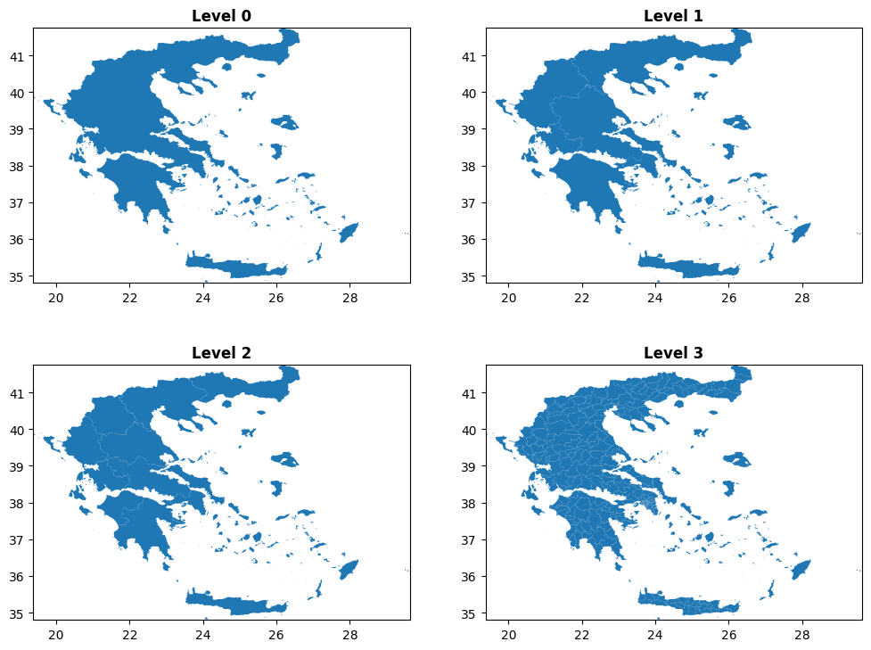

To understand which of the municipalities we want to retain for the analysis we
can operate in the following way. We can get from the CEMS report the
approximate values for the longitude and latitude of the wildfire center, and
then we can explore the `GeoDataFrame` with the center information overlapped:

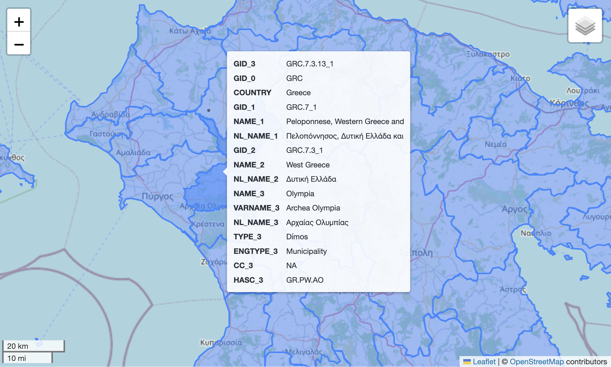

By using [Folium](https://python-visualization.github.io/folium/latest/) we can
easily explore a `GeoDataFrame` by displaying the data information directly on a
visual map. In this case, we decided to keep the data associated with 4
municipalities: municipalities: Erymanthos, Ilida, Dytiki Achaia, Olympia. Now
that we have the municipalities, we can focus our attention on the elements that
we want to use in our analysis to identify what was damaged by the fire and in
which measure. To do so, we have to download data associated with roads, park,
or any other element we want to study. This kind of information can be obtained
from [OpenStreetMap](https://osmfoundation.org/) (OSM), an open-source project
that provides geographic data such as street maps, and that is used in tools
like Garmin GPS to provide low level details of a particular geographic area. We
can obtain OSM data from
[Geofabrik](https://download.geofabrik.de/europe/greece.html) which provides
vectors for the entire Greece in a Geopackage file..The approach to get roads
vector for the previously selected municipalities is pretty simple, and will be
the same for all the other elements we want to analyze. We first import the data
and select the layer associated with the roads:

```python
roads = gpd.list_layers(<FILE_PATH>, layer=6)
```

At this point, we have all the roads of Greece in `roads`, and the 4 selected
municipalities in a variable that we call `aoi`. What we have to do is just to
intersect the two dataset and keep only what intersect with our area of
interest, right? Partially, the general approach is that, but there is a gotcha.
When you describe the shape of a function, or an object, you can not just say,
the value of $f(x)$ is $y$. What are these $x$, and $y$? To unequivocally
identify them, we need also to specify with respect to which point we are
providing the point information. This information in GIS is a bit complicated
because we work not only with a point on a plane, but a point on a very complex
shape like the one of our Earth. It's not here the moment to dive deeper into
the different way a point on the Earth is identified, but is very important to
keep in mind that there are many ways to represent a location, and when we
compare two object, we need to be sure that they are described using the same
**Coordinate Reference System** (CRS). We can get the CRS information directly
from the `GeoDataFrame`:

```python
aoi.crs
```

Which for our municipalities returns:

```text
<Geographic 2D CRS: EPSG:4326>
Name: WGS 84
Axis Info [ellipsoidal]:
- Lat[north]: Geodetic latitude (degree)
- Lon[east]: Geodetic longitude (degree)
Area of Use:
- name: World.
- bounds: (-180.0, -90.0, 180.0, 90.0)
Datum: World Geodetic System 1984 ensemble
- Ellipsoid: WGS 84
- Prime Meridian: Greenwich
```

We can also get the coordinates of the **bounding box** containing our geometry
with `aoi.total_bounds`, which will return the coordinates w.r.t. the associated
CRS. Now that we know what to be careful about, we can perform the intersection:

```python
aoi_roads = gpd.clip(roads.to_crs(aoi.crs), aoi)
```

Where we **projected** the roads into the area of interest CRS with the
`to_crs()` method. The `GeoDataFrame` contains many different kind of roads, but
we are interested only on the principal ones, so we can filter the table to only
keep primary, secondary, and tertiary roads:

```python
road_types = ["primary", "secondary", "tertiary"]
selected_roads = roads[roads["fclass"].isin(road_types)]
```

We can repeat these operations to clip the other elements we want to analyze, in
our case land use and protected areas. At the end of this step we should have
created obtained our vector area of interested plus all the relevant elements
like in the image below:

.")

One important consideration we should do here, is: when a fire breaks out, are
only the precise points of the fire damaged, or the effects are propagated also
to neighboring areas? If we consider a park for example, the effect of the fire
on the trees are present even if the fire was not precisely inside the park. We
can address this issue by inflating the elements geometry by creating a buffer
around them. A buffer is just a way to enlarge the vector by extending it's
thickness by a specific amount. Since this operation requires us to work with
specific distances, we cannot do it in whatever CRS we want, but we need to use
one that correctly represent distances for the area we are investigating.


Yeah, this is probably the reaction you had while reading the last part. But
don't desperate, the concept is not that complex and is associated with the
shape of Earth, and how we measure distances on it. When we work with geographic
coordinates, longitude and latitude, positions are represented with angles, and
they are not good to measure distances. The reason is that the conversion from
angles to meters is not constant over the latitude, since 1 degree close to the
poles is not associated with the same meters of 1 degree close to the equator.
For this reason, we need to be sure to work with a projected coordinate system
that maintains correct distances in the area we are working with. The
correctness of the distances measured depends on how the process of going from a
sphere to a Cartesian reference system is done. Since this process always
involve some approximation, we will have multiple CRS, one precise in a specific
region. This context is not exhaustive at all, but should be enough to
understand how to buffer a shape:

```python
def apply_buffer(data, crs, buffer):
    data = data.copy()
    original_crs = data.crs
    data["geometry"] = data.to_crs(crs).buffer(buffer).to_crs(original_crs)
    return data
```

In our specific case, in the function, we project each vector into the local CRS
identified by the code [EPSG:32634](https://epsg.io/32634). Now, we have all
that we need to move to step two, so we can combine all the data in a single
`GeoDataFrame` and store it into disk:

```python
aoi_and_elements.to_file(generated_dir / "aoi.gpkg")
```

### Let's get raster

In this step, we will retrieve the spectral information for the area of
interested to analyze the pre and post fire conditions and identify the specific
area that was affected by the wildfire. The spectral data is represented using
multi-dimensional arrays which take the name of **rasters**. So the two most
common GIS data types are geospatial vectors for 1-Dimensional data, and rasters
for N-dimensional ones. A raster can be defined by two dimension, when the data
is associated with a particular quantity, and each element in the array is a
specific pixel, or we can have three dimensions, where the third dimension
contains information for different measures. For example, an RGB image can be
represented with a $3 \times N \times M$ raster, where we have in the first
dimension the values of the 3 spectral bands associated with the red, green, and
blue for each pixel. A combination of multiple bands in a specific location and
time is called a **scene**. What we need now, is to retrieve one scene pre fire
and one scene post fire, so we can perform simple differential analysis of the
spectral responses of the terrain.

We can get the desired scenes as already mentioned from the Copernicus database,
which provide data in a standardized way by adhering to the **SpatioTemporal
Asset Catalog (STAC)**, in which data is organized by catalogs with a specific
structure.

The STAC catalog for the Sentinel-2 data is stored into an S3-like bucket
managed by Copernicus and accessible at the host
`eodata.dataspace.copernicus.eu`. To connect with this host, we use a client
capable of interacting with the STAC API. One example for Python is the
[pystac_client](https://pystac-client.readthedocs.io/en/stable/usage.html). In
the notebook we use thin wrapper class around the client:

This step is abstracted away in the notebook by using a simple class which is
used this way:

```python
client = SentinelStacClient(url)
```

For the pre and post fire scenes we used the same dates used in a
[paper][castro-melgarwildfiresearlysummer2025] that analyzed the same wildfire:

| Condition |     Date     |
| :-------: | :----------: |
| Pre-fire  | 16 June 2024 |
| Post-fire | 26 June 2024 |

At this point, we can query the catalog to get an item that satisfy our
constraints. During the search we specify the desired time interval, the
bounding box, and the max cloud coverage. This last filter is very important
since clouds does not permit to see the spectral response of the surface beneath
them, so pixels that are covered by clouds must be considered as noise. Below is
reported an example of the GeoJSON information associated with a STAC item for
the pre fire date. GeoJSON is a fundamental data format describing geospatial
assets:

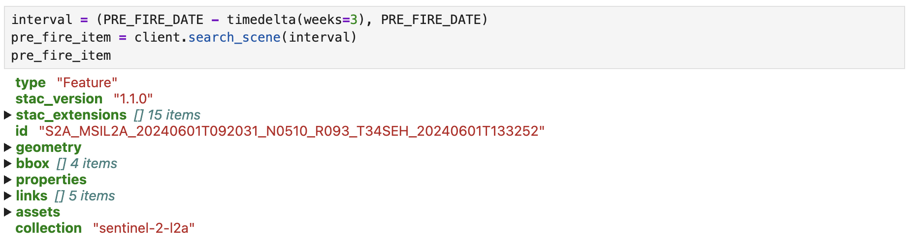

At this point, we didn't actually get the tile with band information. What the
catalog is design to do, is to just providing an `href` we can then follow to
download the data we want. Here another important aspect, even though we can
access it to query information via the API, to download the data we need to set
the environment variables that will be used by the `boto3` system. You can get
your access token from the Copernicus browser webpage.

The variables are then loaded in the context with:

```python
os.environ["AWS_S3_ENDPOINT"] = "eodata.dataspace.copernicus.eu"
os.environ["AWS_VIRTUAL_HOSTING"] = "FALSE"
os.environ["AWS_ACCESS_KEY_ID"] = os.getenv("ACCESS_KEY")
os.environ["AWS_SECRET_ACCESS_KEY"] = os.getenv("SECRET_KEY")
```

The virtual hosting flag is needed to properly resolute the href path which for
Copernicus does not follow the classic s3 structure. We just need to load the
env variables into scope because by using
[rasterio](https://rasterio.readthedocs.io/en/stable/) the authentication phase
is managed automatically.

```python
pre_fire = client.search_scene(interval)
with rasterio.open(pre_fire.assets["B04_10m"].href) as src:
    raster = src.read()
```

Rasterio is Python library that binds with the Geospatial Data Abstraction
Library (GDAL) used in GIS to read the standard format used for geospatial
applications called GeoTIFF and to create handy numpy arrays out of them.
GeoTIFF stands for **Geographic Tagged Image File Format** and defines the
requirements and how to encode images along with geographic information. In GIS
it is common to not work directly with Numpy array but to use xarray. We can
easily work with them by using a rasterio wrapper called
[rioxarray](https://corteva.github.io/rioxarray/html/rioxarray.html).

To get the data associated with the bounding box containing our AOI vector
created in the previous step, we had to download rasters associated with two
tile, the **34SEG** and the **34SEH**. A visual RGB image of the tiles is
reported below:

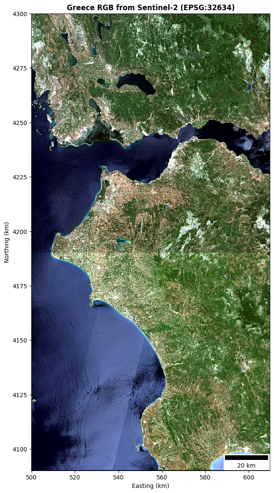

The procedure to combine data from rasters of different locations is called
**mosaic operation**. From the image we can observe two interesting things:

- Tile shadow: Since the two tiles have been generated in two different moments
  they have slightly different conditions. Moreover, I normalized the data
  before creating the mosaic...
- Satellite swath: The trajectory followed by the satellite in the acquisition
  is pretty visible by the swath fingerprint, the diagonal stripe crossing the
  image.

We can also cut the mosaic to the precise bounding box of the vectors data:

```python
aoi_box = aoi_and_elements.to_crs(mosaic.rio.crs).total_bounds
mosaic_clip = mosaic.rio.clip_box(*aoi_box)
```

Where `.rio` allows to access the rasterio methods directly on the
`xarray.DataArray` of the mosaic. By plotting the clipped mosaic and the
elements in the AOI we obtain:

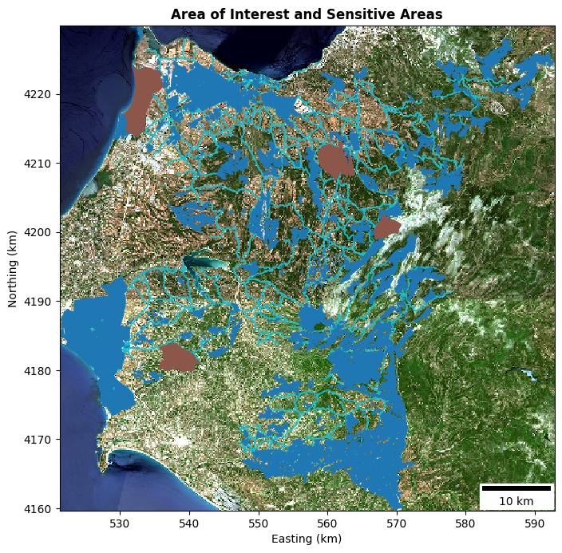

Let's now create the mosaic of the bands we concretely use for the differential
NBR analysis: "B8A_20m" and "B12_20m". The Copernicus database stores the values
of these bands not directly as reflectance, but a scale called Digital Number
(DN). We can convert the value to reflectance by using the information contained
in the bands metadata

```json
raster:scale 0.0001
raster:offset -0.1
```

The conversion from DN, to what we want, the **Bottom of Atmosphere** (BOA)
reflectance is:

$$
BOA = DN * scale + offset
$$

The greyscale visualization of the two bands for the two retrieved scenes is:

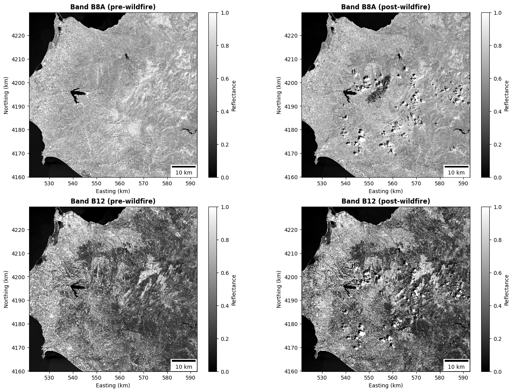

From the picture we can see that the water is absorbing in both the frequency
bands, while clouds, present only on the post fire image, have the opposite
behavior. It is also possible to see a black region in the band B8A, which is
exactly where the wildfire happened. This is because damaged vegetation absorb
in the NIR instead of reflecting like the healthy one. To better highlight the
burn scar, we should find a way to push the pixel values of that region to one
of the boundary of our color scale. Now for example, we see that the water is
way darker than the scar. We can achieve this goal by using a false color image
composed by the bands associated with the SWIR, NIR, and Green, obtaining an
image that allows the burned scar to nicely stand out compared to all the other
surface types:

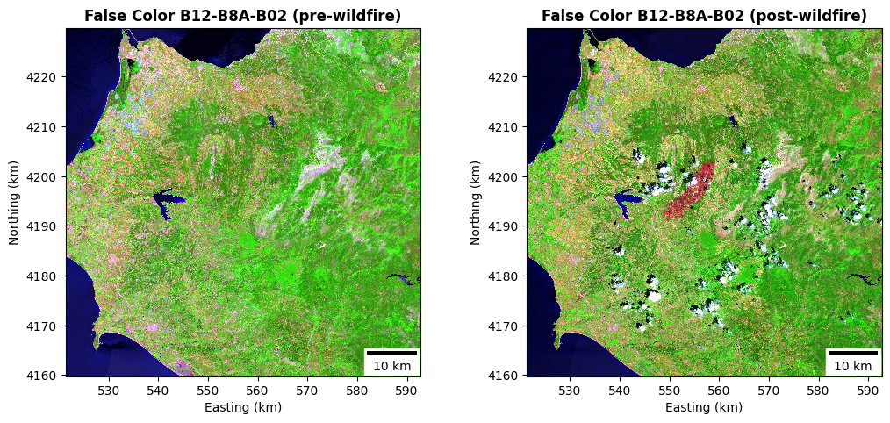

The high reflectance of old hash on the surface of the scar allows to identify
the affected region with the red color.

As we saw from the previous image, the post scene is contaminated by a lot of
clouds. Clouds and water are elements that are not important for the wildfire
assessment and are known to cause issues for the dNBR calculation. We can mask
out pixels associated with these condition by using the
[Scene Classification Layer](https://custom-scripts.sentinel-hub.com/custom-scripts/sentinel-2/scene-classification/)
(SCL) provided along with the other spectral bands. This raster contains
categorical values classifying the pixels in on of the 12 used classes:

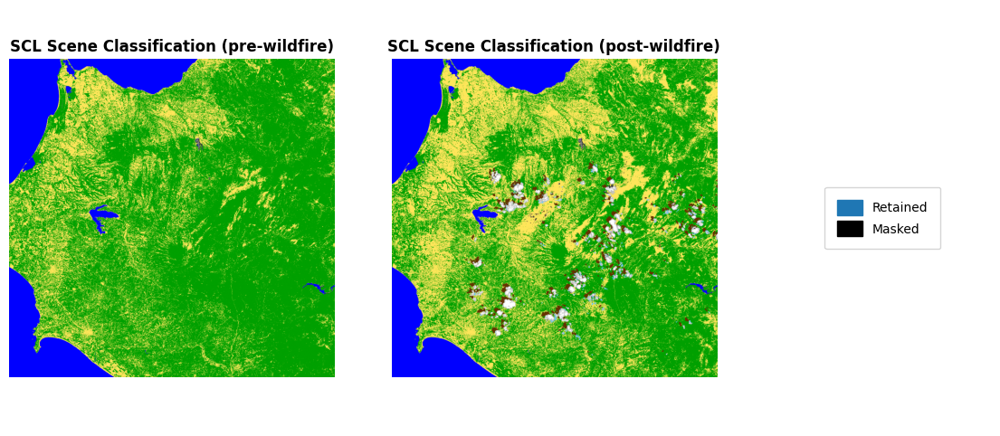

Our mask will be used to remove pixels associated with *nodata, saturated or
defective, dark/topographic shadow, cloud shadow, water, unclassified cloud
medium probability, cloud high probability, thin cirrus, snow or ice*:

```python
mosaic_scl_mask = mosaic_scl_pre.isin(bad_pixels) | mosaic_scl_post.isin(bad_pixels)
```

Another raster that we will use in the wildfire analysis is the one containing
the NDVI data for the AOI. We will use this raster to filter out pixel that are
not associated with vegetation:

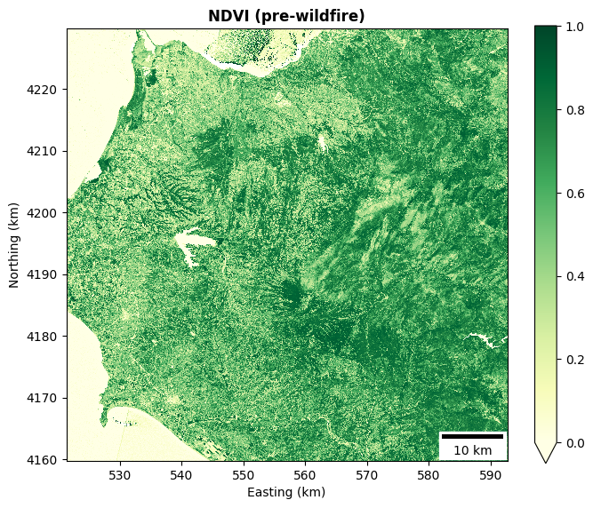

### Wildfire segmentation and classification

This is the last step of the methodology, in which all the data generated in the
previous step is used to algorithmically segment the burn scar and to assess its
impact on the underlying surface. As a first action, we compute the dNBR for
both the pre and post fire scenes:

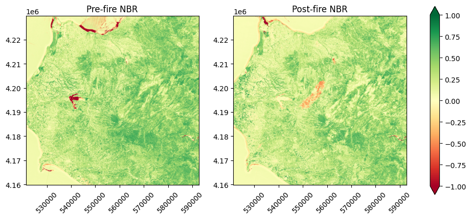

What we can observe from the two NBR plot, is that in the post fire scene, the
burn scar appears as a region of pixels with negative values. However, it is
also evident how the water region can cause confusion in the interpretation of
the data. From the pre to the post scene, we have regions associated with water
that went from negative values to positive and others that did the opposite. The
other issue with the plain NBR, is that there is no cross information between
the two scenes, and the indexes are computed without any reference to two
different instant in time. For this reason, and to mitigate the water effect,
the differential NBR is used. Before visualizing the data, we can classify each
pixel of the dNBR raster by using the USGS classification table. In doing so, we
will also apply the SCL mask to the raster to remove known false positives and
cloud noise:

```python
dnbr_masked = np.where(scl_mask.squeeze() == 0, dnbr, np.nan)
```

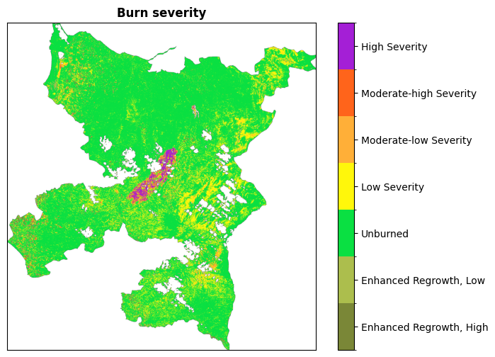

Nice! Our dNBR raster combined with the SCL map allowed us to create an image in
which the burned scar is clearly associated with a organic cluster of high level
severity pixels. Despite that, we can see that not only the scar is associated
with burned pixels, there are a lot of less organic regions where burned pixels
are scattered with the classic salt-and-pepper pattern, and other regions where
there are uniform low severity regions. This behavior is expected given that
also dNBR is sensible to other factors that have not been masked out. For
example, there is no way for the index to discriminate between agricultural land
that have been harvested or burned area. If we create an RGB image where all
burned pixels are assigned to the red value, the situation appears even more
scaring:

```python
burned = dnbr >= 0.1

masked_rgb = xr.zeros_like(mosaic_visual)
masked_rgb[0] = mosaic_visual[0].where(~burned, 1)
masked_rgb[1:3] = mosaic_visual[1:3].where(~burned, 0)
```

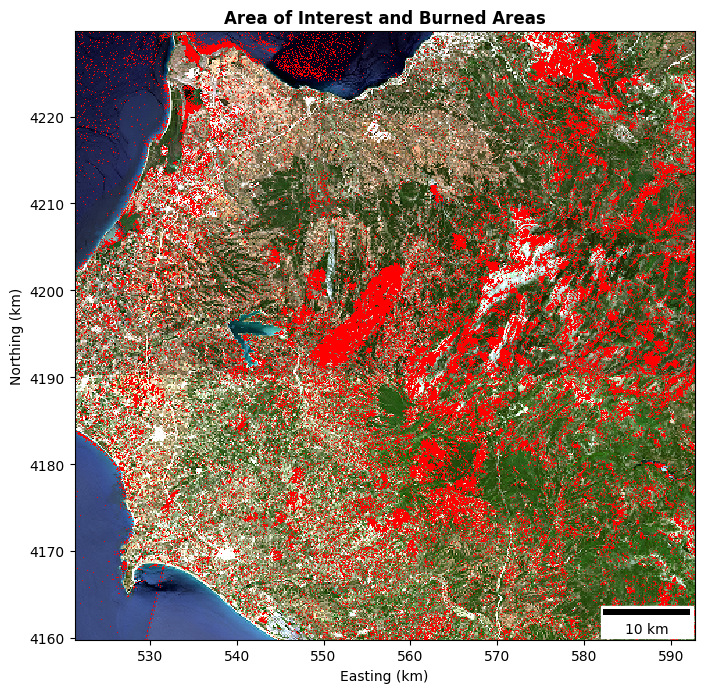

The image display the entire area of interest with burned pixels without any
mask applied, so also all the false positives associated with water are clearly
visible.

To improve the segmentation, we could use other datasets with more specific
classes to remove all the regions that cannot be associated with the wildfire,
but I do believe that is more funny trying to automatically segment the image
without too much help from external source!

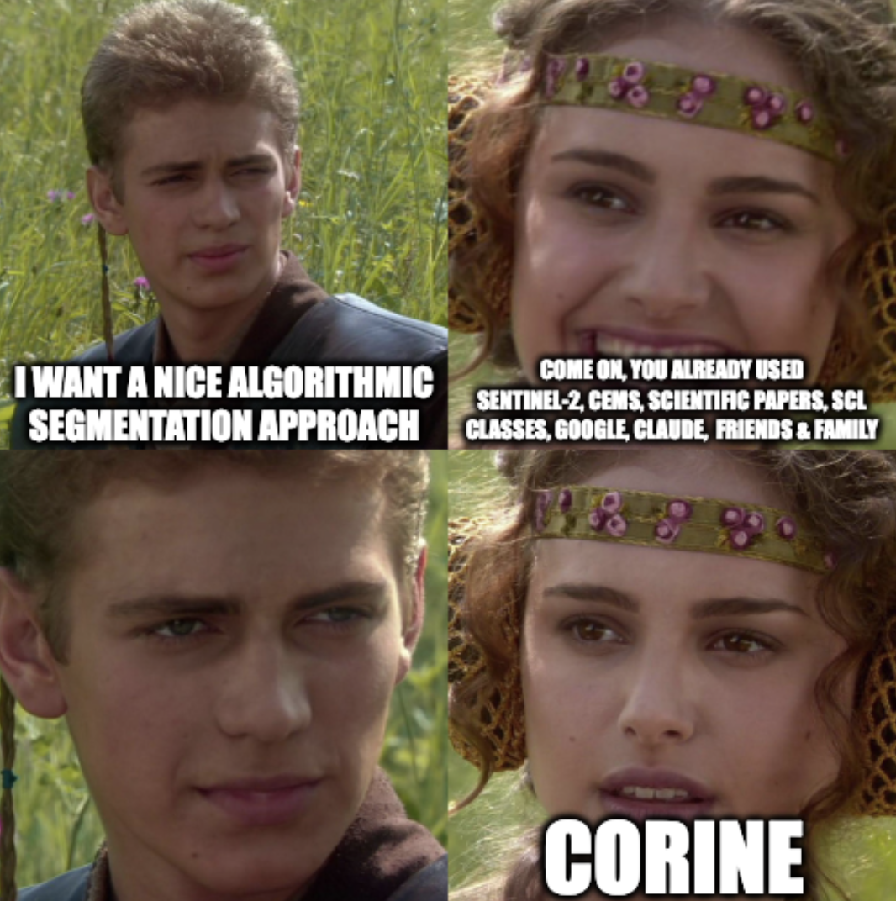

The post-processing phase we will follow is composed of the following steps:

- SCL mask application to remove measurement noise.
- Pre scene NDVI mask, which is used to filter out non-vegetated pixels which
  differential value would be meaningless.
- A sieve filter.

The sieve filter is an approach which allow us to collapse all the regions that
have a connected area lower than a Minimum Mapping Unit (MMU). This is a classic
post-processing filter applied when analyzing geospatial images. As we can see
from the next image, despite the application of these filters, it is almost
impossible to completely remove some of the false positives.

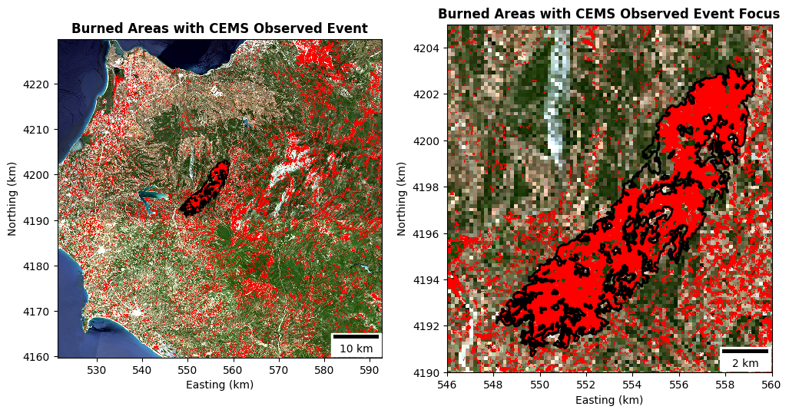

But don't desperate, this is completely fine since our dNBR index is pretty
dumb, it just check where a pixel had a specific variation in reflectance, and
this variation can be caused by many reasons. The soundness of the analysis is
also reinforced by two observations:

- The mean of the dNBR index across the entire raster is almost zero.
- The USGS classification has been designed for regions with characteristic
  different than Europe landscapes.

Another important observation is that the differential index is based on two
scenes collected at different dates, and so it is time-dependent. The best case
would be to acquire one image right after the ignition of the fire, and one fire
after. In our case, the two scenes used are pretty far in time, and this
introduced in the analysis a temporal bias that could have introduced a seasonal
change in the vegetation health. So, despite close to zero, we could also
improve the analysis by removing the average dNBR to all the pixels in the
attempt to obtain a more robust analysis.

The next step is to algorithmically create a segmentation for the scar. The
approach we will pretty simple, we create shapes out of raster feature, and then
we keep the shape with the higher area. A feature is considered as a connected
region with common feature, in this case if it a burned pixel or not. After this
operation, we can see that we clearly segmented the burned are:

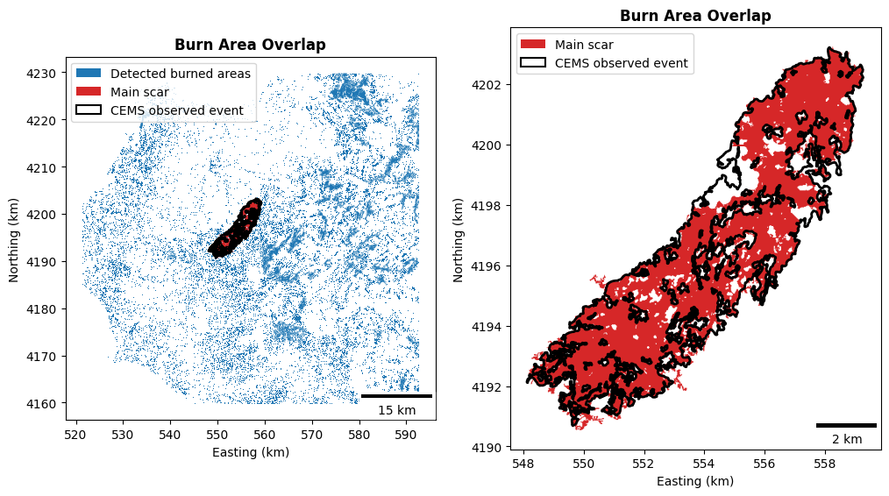

In blue we can see all the detected burned point, in the red the segmented scar,
and in black the perimeter of the wildfire segmented by CEMS. We should be
satisfied enough noticing that our segmentation is very close to the CEMS one,
except in the region that was covered by clouds, issue that can be easily solved
by using a scene from another day.

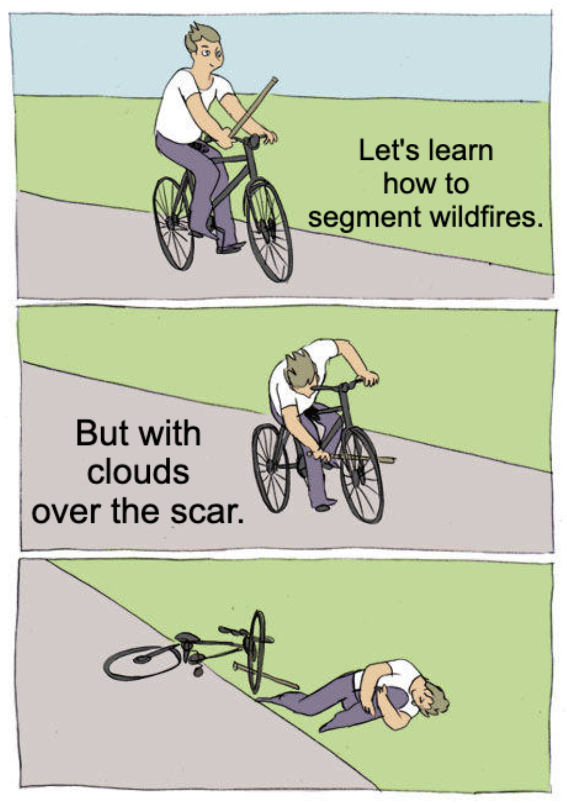

Despite that self-sabotage of the analysis, we obtained a result pretty close to
the reference in terms of segmented area as visible in the next table.

|                      | CEMS  | stepit |
| -------------------- | ----- | ------ |
| Burned area $[km^2]$ | 38.66 | 38.89  |

A more fair comparison can be obtained by evaluating classic computer vision
metrics which take into account not only the overall areas:

- **Precision**: fraction of the detected area lying inside the reference (how
  much of what we mapped was really burned).
- **Recall**: fraction of the reference area that we detected (how much of the
  real scar we captured).
- **Intersection over Union (IoU)** (intersection over union): a single score
  combining both.

| Precision | Recall | IoU  |
| --------- | ------ | ---- |
| 0.87      | 0.86   | 0.76 |

We can now visualize the USGS burn severity level inside our scar polygon and
the associated classes distribution:

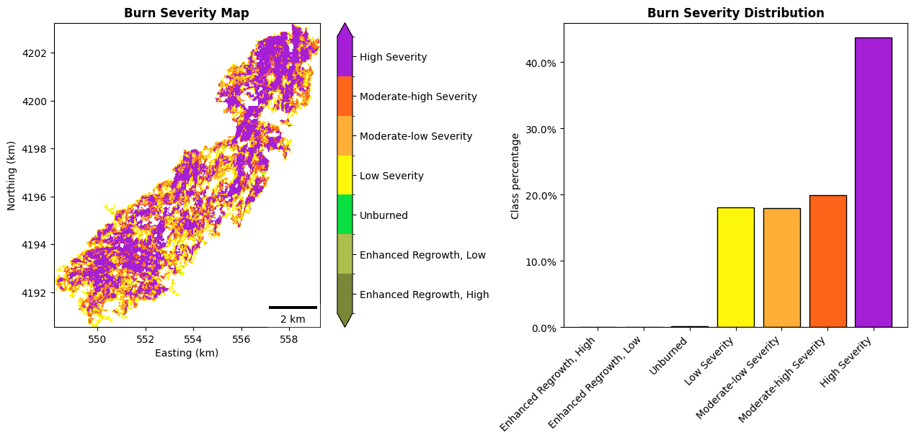

The fact that the majority of the pixels have been classified as high severity
is coherent with the fact that this has been one of the most severe wildfire in
the entire Greece's history. The paper from
[Castro et. al.][castro-melgarwildfiresearlysummer2025] obtained quite different
results in the classification but in doing the assessment, they used a slightly
variation of the dNBR index but still used the USGS classes. Indeed, they never
obtained high severity pixels in all the analysis performed. As a concluding
step, we can evaluate which and in which measure, the selected critical elements
have been impacted.

| Element          | Absolute Value $[km^2]$ | % of Segmented Scar |
| ---------------- | ----------------------- | ------------------- |
| Roads            | 4.82                    | 12.4                |
| Protected areas  | 0                       | 0                   |
| Natural land use | 33.57                   | 86.3                |

## Conclusion

Let's wrap up what we did and what we learned in this first post about EO
analysis. We touched a bit on how remote sensing is performed and what
electromagnetic bands are. We discovered that bands are used to generate rasters
from which scientists can understand the status of the Earth's surface by
analyzing the responses at various frequencies.

With a basic understanding of the context, we moved into the data part, and
understood how to gather and manipulate the data directly from satellite
observations. We used the data associated with multiple bands like the NIR, Red,
and SWIR to compute the spectral indexes and identify an area affected by a
wildfire in Greece. In doing so, we worked with all the most common used GIS
libraries and data types. From the dNBR, we then automatically segmented the
scar after a post-processing phase to remove noise and false positives. The
wildfire has then be classified by using USGS severity classes and validated
against the report created by CEMS, obtaining good results in terms of
identified area and IoU metric.

This was a nice journey into the classic techniques used in wildfire monitoring
and assessment. In the next posts we will investigate other applications of
satellite imagery and more advanced techniques based on machine learning and
deep learning. I hope you enjoyed, see you in the next article!

## References

1. [Work with the Difference Normalized Burn Index - Using Spectral Remote Sensing to Understand the Impacts of Fire on the Landscape][earth lab: work with the difference normalized burn index]
1. [Wildfires During Early Summer in Greece (2024): Burn Severity and Land Use Dynamics Through Sentinel-2 Data][castro-melgarwildfiresearlysummer2025]
1. [Newcomers Earth Observation Guide][esa introduction]
1. [What is SWIR? Short-wave infrared data, explained][what is swir]
1. [Normalized Burn Ratio (NBR)][nbr]
1. [Tiling system]

[castro-melgarwildfiresearlysummer2025]: https://www.mdpi.com/1999-4907/16/2/268
[earth lab: work with the difference normalized burn index]: https://earthdatascience.org/courses/earth-analytics/multispectral-remote-sensing-modis/normalized-burn-index-dNBR/
[esa introduction]: https://business.esa.int/newcomers-earth-observation-guide
[geojson]: https://en.wikipedia.org/wiki/GeoJSON
[nbr]: https://un-spider.org/advisory-support/recommended-practices/recommended-practice-burn-severity/in-detail/normalized-burn-ratio
[s2 products]: https://sentiwiki.copernicus.eu/web/s2-products
[stac]: https://stacspec.org/en/
[tiling system]: https://hls.gsfc.nasa.gov/products-description/tiling-system/
[what is swir]: https://up42.com/blog/swir-short-wave-infrared-data-explained
