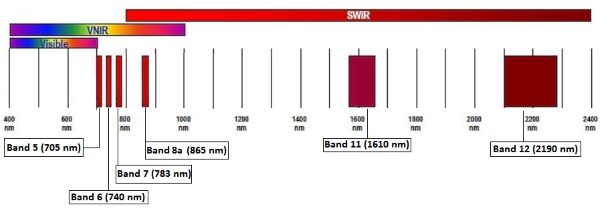
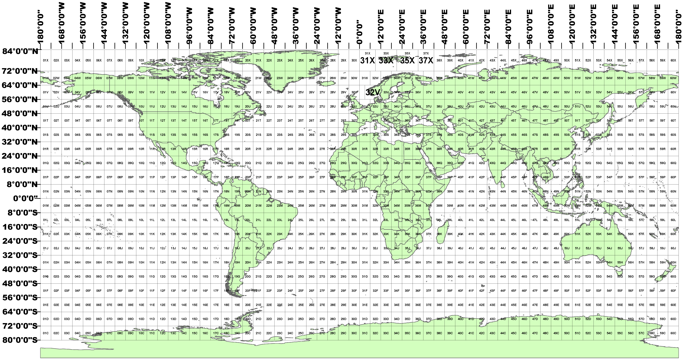
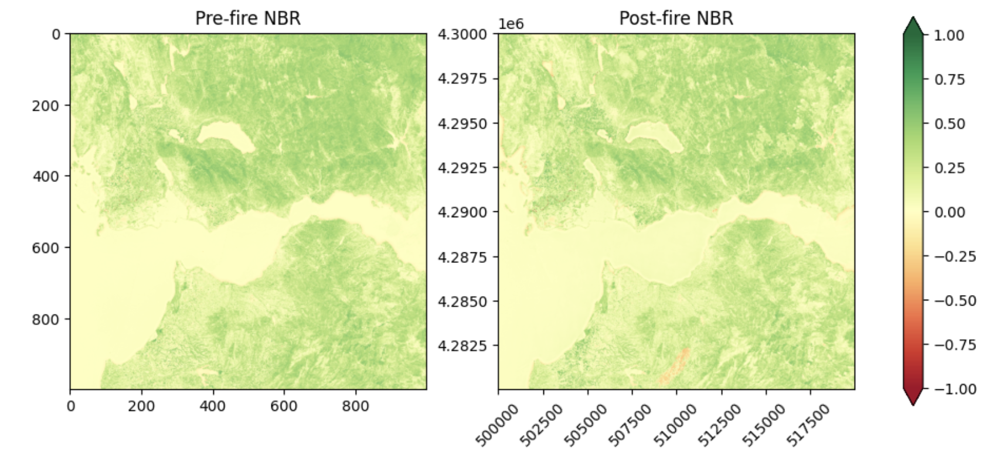
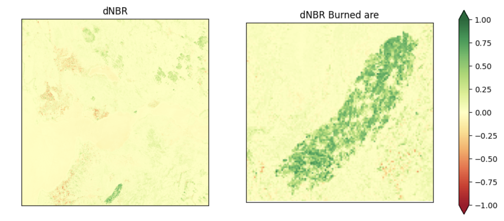
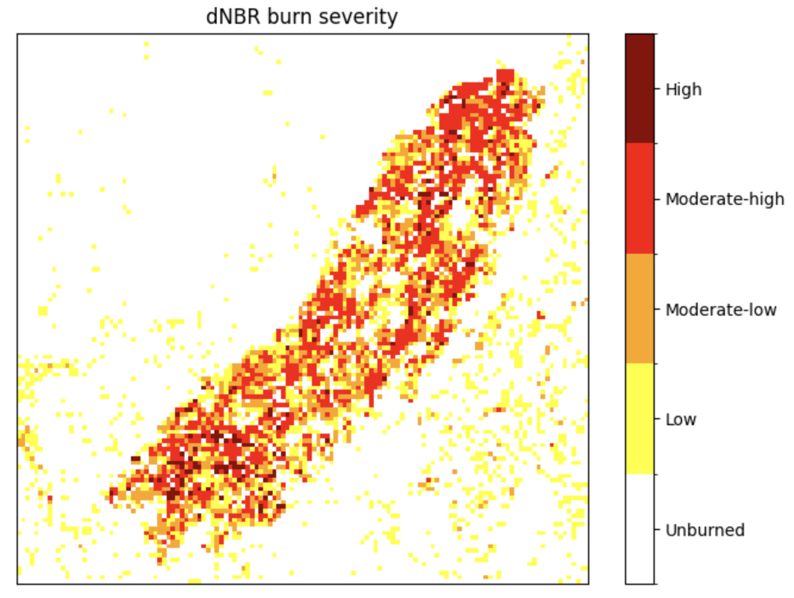

## Introduction

I've always been fascinated by the world around us, and the many ways we try to
understand it. We experience reality from different perspectives: through the
formal language of math and physics, or by capturing snapshots of it in a
photography or a painting. In recent years we saw a massive improvement in the
technology we have at hand, in particular algorithms and computation power. A
natural question may arise: how can we introduce this technology in the loop and
use it to observe and assist the planet we are living on?

This article is the first in a series documenting my journey in understanding
Earth observation techniques, where I explore how we can leverage algorithms,
math, and photography to help us better understand our environment. This first
part will mainly cover definition, data retrieval and interpretation, and some
basic classic techniques.

Among the many applications in this field, I've chosen to focus on detecting
wildfires using satellite data. In particular, we will investigate the
Achaia-Ilia wildfire that happened in Greece during June 2024. The decision to
study this event is motivated by the fact that it is fairly recent, and because
I found a [paper][castro-melgarWildfiresEarlySummer2025] with a good level of
accuracy, which we can use to gather relevant information and for comparison. I
hope you enjoy reading this post as much as I enjoyed learning the concepts
behind it.

This article is accompanied by scripts and a notebook you can find in the
[burn-area-detection repo](https://github.com/0xstepit/burn-area-detection)

## GIS and Satellites

Applications of earth observation use informative systems called GIS, which
stands for Geographic Information Systems. These systems allow connecting data
with specific geospatial information. These systems are of paramount importance
since Earth Observation (EO) is the process of acquiring observation of the
Earth's surface and atmosphere via remote sensing instruments. Data acquired
this way is usually in the form of digital images, which in a computer are
nothing but a matrix of numbers, or a `numpy` array if you are familiar with
Python. Data acquired alone is not really useful; it's just raw material that in
this case needs geospatial information to analyze it and use it in real
applications.

Observations of the Earth are done in different ways, but the most common one is
through satellites in close orbits around us. Acquisition of the images can be
obtained in two ways:

- **Passive imagery**: this approach is based on the observation of the
  electromagnetic emissions of the Earth's surface and the atmosphere. These
  emissions are mainly due to reflection of the sunlight or internal production
  from vegetation.
- **Active imagery**: this approach is based on systems composed of a
  transmitter that sends a specific signal to the Earth and a sensor that
  receives information of the interaction of the signal with the surface. The
  time between the signal sent and the one returned, and the intensity, are used
  to evaluate different properties.

In the context of burn area detection, we will focus on the usage of passive
imageries obtained with multi-spectral instruments. Without going too much into
detail here, it is important to know what is the electromagnetic (EM) spectrum
and the radiation.

The electromagnetic radiation (EMR) is a form of energy, like the gravitational
one, that propagates as waves traveling through space. These waves are what
constitute the electromagnetic field. Although we don't see these waves like we
do in the ocean, for example, they are constantly present around us, with the
Sun being the primary source.

The EMR is associated with energy which is characterized by its frequency. The
frequency is measured in Hertz ($Hz = \frac{1}{s}$) and allows us to create the
electromagnetic spectrum by classifying radiation into different regions. The
colours we see around us are just a small part of the entire spectrum.

Each frequency band is associated with different information. In EO, we take
advantage of this by combining different bands together to extract the data we
need based on the application.

The multi-spectral instrument allows to collect imagery containing a combination
of bands that creates composite images. Based on how these images are composed,
we can perform different types of analysis. We can for example use them to
highlight specific features or patterns.

The **reflectance** of the objects is what allows us to study the surface of our
planet. It is defined as the fraction of the incident electromagnetic power that
is reflected by the object and the one that reaches the body. Remote sensing
techniques work by observing what is reflected by the Earth's surface.

## Sentinel-2

For our investigation we will use the data provided by the European Space Agency
(ESA) Sentinel-2 mission which are kindly accessible for free. Data is
distributed by the **Copernicus Data Space Ecosystem (CDSE)**.

Before diving into the data, it is useful to learn some parameters of a
satellite that directly impact our analysis.

The **swath** of a satellite is the strip on the ground the satellite is able to
acquire images from during its orbit. Higher is the swath width and higher is
the portion on the ground we can observe with a pass of the satellite. This
parameter tends to be inversely proportional with the resolution. Swath can also
overlap in adjacent orbits.

- **Spatial resolution**: one way to assess it is by computing the difference in
  space between adjacent pixel center on the ground. Very high resolution
  systems provide a spatial resolution below 5m.
- **Spectral resolution**: is the analogous of the previous one but for the EMS.

Each satellite in the Sentinel-2 mission carries as a payload a Multi-Spectral
Instrument (MSI) capable of sampling 13 bands in the EMS and have a swath width
of 290 km.

For Sentinel-2 we have the spatial resolution which depends on the spectral
band, and for this reason the acquisition of images for the different bands are
different for each spatial resolution. For our analysis we are interested in two
spatial resolutions, the 10 m and 20 m, and will not consider the 60 m one:




For the indexes we are going to analyze, we are interested in the following
bands:

- Band 4 at 10m for the visible red.
- Band 8 at 10m for the near infrared.
- Band 8a at 20m for the near infrared.
- Band 12 at 20m for the shortwave infrared.

In the 20m spatial resolution we are using the SWIR at band 12 and not 11
because it should be better correlated with burn severity measure.

What we are interested in from the products offered for the Sentinel-2 is called
granule, or also commonly referred to as **tile**. A tile is a snapshot for all
the spectral bands with a spatial dimension of
$110 \: \text{km} \times 110 \: \text{km}$. These tiles are represented using
the **Universal Transversal Mercator (UTM)** reference system to project
geographic coordinate in the sphere to a plane reference system, easy and nice
to work with. Within this system, the Earth's surface is divided in different
regions like visible in the picture below, and each rectangle is divided into
different tiles.



## Classic burn detection techniques

### The normalized difference vegetation index

The **Normalized Difference Vegetation Index (NDVI)** is a metric used to
quantify the health and density of vegetation using two electromagnetic bands:

- **Red**: indicates a high level of chlorophyll.
- **Near infrared (NIR)**: healthy vegetation is characterized by a high
  reflectance in this band.

The reason behind the composition of this index is that plants absorb solar
radiation, the red part, to operate the photosynthesis. In doing so, they
re-emit solar radiation in the NIR band.

The formula is as follows:

$$
\text{NDVI} = \frac{\text{NIR} - \text{RED}}{\text{NIR} + \text{RED}}
$$

So, in healthy vegetation we expect to see high absorption in the red band, and
high emission in the NIR one, causing the NDVI to be close to 1. More generally,
we can interpret the value of the NDVI as reported in the below table.

| NDVI | Object                          |
| ---- | ------------------------------- |
| < 0  | water bodies                    |
| ~ 0  | rocks, sands, concrete surfaces |
| > 0  | vegetation                      |

### The normalized burn ratio

The **Normalized Burn Ratio (NBR)** is an index used to identify burned areas.
This index is obtained using two EM bands:

- **Near infrared (NIR)**: healthy vegetation is characterized by a high
  reflectance in this band.
- **Shortwave infrared (SWIR)**: healthy vegetation is characterized by a low
  reflectance in this band, while burned areas have a high reflectance
  percentage. The particularity of this radiation is that it is able to pass
  through smoke from fires.

As visible from the picture (TODO), the NIR is associated with the band between
760 and 900 nm in the EM spectrum, while the SWIR is the band between 2080 and
2350 nm.

The formula for the NBR is as follows:

$$
\text{NBR} = \frac{\text{NIR} - \text{SWIR}}{\text{NIR} + \text{SWIR}}
$$

where the denominator allows to normalize the values in the range $[-1, +1]$.
What is interesting to appreciate is how this index uses a difference in the
value of two different bands.

The NBR is used in a differential form to evaluate the severity of a wildfire by
evaluating the delta between the NBR pre and post fire. This is particularly
useful because it allows us to discriminate between recently burned area and
bare ground, since both are associated with a low value of the NBR.

$$
\text{dNBR} = \text{nbr}_{pre} - \text{nbr}_{post}
$$

The dNBR index is particularly sensitive to the combination of location and
delta of time. In location like tropical areas, vegetation regrowth is
particularly fast, and for this reason it is important to take a post fire
snapshot not too far in time to have a meaningful measure.

Based on the value of the dNBR, we can assess the severity using the following
table:

<a id="severity-table"></a>

|      Severity Level      |       dNBR        |
| :----------------------: | :---------------: |
|         Unburned         |       < 0.1       |
|       Low severity       | >= 0.1 && < 0.27  |
| Moderate - low severity  | >= 0.27 && < 0.44 |
| Moderate - high severity | >= 0.44 && < 0.66 |
|      High severity       |      >= 0.66      |

The burn severity is a measure of how the fire intensity affected the
functioning of the ecosystem in the area affected.

## Investigation

### Download data

The most direct approach to get Sentinel-2 data is through the
[Copernicus browser](https://browser.dataspace.copernicus.eu/?zoom=5&lat=50.16282&lng=20.78613&themeId=DEFAULT-THEME&demSource3D=%22MAPZEN%22&cloudCoverage=30&dateMode=SINGLE).
If you are new to EO like me, it will not be very intuitive how to use the
website, but I do believe it is very informative and useful to play around with
the manual download of the data before passing to a more easy approach. If you
like, there are also
[videos](https://www.youtube.com/@copernicusdataspaceecosystem) showing how to
use the Copernicus browser, but I haven't watched them, so, if you do, please
let me know how they are!

If you want to download the same tile I used in the `indexes-introduction`
notebook, please copy&paste this string into the **Search Criteria** and then
press **Search**:

`S2A_MSIL2A_20260409T101051_N0512_R022_T33UVU_20260409T170912`

Please notice that this tile is not associated with any wildfire but was mainly
used to learn how to navigate the Copernicus browser (and refresh some
Python........).

If you are interested in understanding what this id means, please refer to the
[S2 products] web page, but is the unique identifier in space, time, and
boundary condition of the image of the tile we will study. The only other
interesting thing to mention here, is that the part `T33UVU` indicates the
specific tile we want, and you can find its position in the tiling system
picture by looking for the `33U` rectangle. Also, we are using the 2A product
because provides images with atmospheric correction already applied. Images at
Top of Atmosphere (TOA) are provided with the 1C product.

From the left side you download the zip file containing all the data associated
with this scene.


Unzipping the file will give you a `.SAFE` folder, which stands for Standard
Archive Format for Europe. You can then find all the band images represented
with the `.jp2` format which is the newer standard of the old `.jpg` one,
designed with the support for georeferencing in mind.

A better alternative for downloading data is via API. In this context, the
industry maturated creating a common standard to store and provide geospatial
information, and this standard is the [**SpatioTemporal Asset Catalog
(STAC)**][STAC]. In this language, we refer to a specific asset, like a band
image, as an item. An item is stored in the standard [GeoJSON] format.

In understanding how to use the API, we will download a tile containing the
wildfire happened in Achaia-Ilia. From now on, I strongly recommend to follow
along using the `greece-achaia-ilia-wildfire` notebook to understand how each
step is implemented.

From an image in the paper we can get the coordinate in the **Degree Minutes
Second (DMS)** format:

<a id="severity-pic"></a>


In order to use them, we first have to convert them into the **Decimal Degree
(DD)** coordinate system. These values can be used to create a **bounding box**,
which is used in GeoJSON to refer to the geometry of the tile considered. The 4
values used represents the values of the constant longitudes and latitudes
containing the tiles in this order:
`[west coord, north coord, east coord, south coord]`.

The STAC catalog for the Sentinel-2 data is stored into an S3-like bucket
managed by Copernicus and accessible at the host
`eodata.dataspace.copernicus.eu`. To connect with this host, we use a client
capable of interacting with STAC API, which is for example the `pystac_client`.
This step is abstracted away in the notebook by using a simple class which is
used this way:

```python
client = SentinelStacClient(url)
```

Since our goal is to assess the wildfire intensity, we will use the dNBR, and so
we will need to find one image pre fire and one image post fire. These two dates
are taken from the paper and are:

| Condition |     Date     |
| :-------: | :----------: |
| Pre-fire  | 16 June 2024 |
| Post-fire | 26 June 2024 |

At this point, we can query the catalog to get an item that satisfy our
constraints. In this case, we set just the bounding box, cloud condition, and
the time interval. Below is reported an example of the GeoJSON information
associated with a STAC item.


Now, if we just try to get an image for the post-fire situation, we could end up
in the situation where the returned tile is just partly populated because the
result of a not full swath on the bbox specified. To avoid this situation, we
can refine our search by specifying additional query parameters. In my case, I
realized that I was working with an almost empty tile just after looking how bad
was the severity score obtained (:D). After that, I started also plotting the
two tiles on a map to visualize if the item has the expected shape.

At this point, we didn't actually get the tile with band information. What the
catalog is doing is just providing an `href` we can then follow to download the
data we want. Here another important aspect, even though we can access it to
query information via the API, to also download the data we need to properly set
the environment variables which will be used by the `boto3` system. The
variables are then loaded in the context with:

```python
os.environ["AWS_S3_ENDPOINT"] = "eodata.dataspace.copernicus.eu"
os.environ["AWS_VIRTUAL_HOSTING"] = "FALSE"
os.environ["AWS_ACCESS_KEY_ID"] = os.getenv("ACCESS_KEY")
os.environ["AWS_SECRET_ACCESS_KEY"] = os.getenv("SECRET_KEY")
```

where the virtual hosting flag is needed to properly resolute the href path
which for Copernicus does not follow the classic s3 structure.

The download process is done under the hood using the `rasterio` library. An
example of how it is done in the notebook for the band 8a with 20 m spatial
resolution is:

```python
b8a_20m_pre, _ = client.read_band(pre_fire_item.assets["B8A_20m"].href)
```

[Rasterio] is a powerful tool used in GIS to read the standard format used for
geospatial applications called GeoTIFF and to create handy numpy arrays out of
them. GeoTIFF stands for **Geographic Tagged Image File Format** and defines the
requirements and how to encode images along with geographic information.

It is just that, nothing too complex. We load the required environment variables
into scope, and then boto3 and rasterio do the job for us. The abstraction
provided returns directly the raster values of the selected band. Below the
snippet of the code that read the raster values, convert them to float, and if
requested, downsample the pixel values:

```python title="src/band.py"
f.read(1, out=out_shape, out_dtype=np.float64)
```

A raster is the name given to a grid of values which represent pixel values. In
the case of Sentinel-2 band, the values in the raster are a digital
representation with 16 bits of the **surface reflectance**. You can read more
about it in the product page of the Sentinel-2 level 2A product if you like.

Given the rasters of the band we need, we can compute the pre and post fire NBR
values.



As we can see, in the post fire image we have a region in the lower-central part
which has pixel values in the red part of the cmap. This is the region where the
wildfire happened.

Notice that the picture intentionally report two different axis. This is not
because the values are defined on two different tiles, obviously, but because
they are using two different reference systems. In the left image, we use the
array reference system, which is positional in the array itself. In the right
image, we perform a transformation to bring each pixel on its real geographic
position. More technically, what we do is an affine transformation of the
points, which is nothing but a combination of a linear transformation plus a
translation of the raster values. Basically, we move the raster on the correct
space position and stretch it to the correct size while preserving the
structure.

We can have a better visualization by computing the delta of the NBR:



We can now clearly visualize the section of the Earth's surface that was
affected by the fire. Comparing this image with the one of the
[paper](#severity-pic), we can confirm that we correctly applied the indexes to
perform burn area detection with classic methods (in a qualitative not
quantitative way).

Despite we were able to discover the burned area, we don't have a clear overview
of the severity in each of the points. We can improve the visualization by
classifying each of the pixel into one of the 5 severity groups reported in the
[severity table](#severity-table). To do so in python:

```python
conditions = [
    dnbr_cut < 0.099,
    (dnbr_cut >= 0.1) & (dnbr_cut <= 0.269),
    (dnbr_cut >= 0.27) & (dnbr_cut <= 0.439),
    (dnbr_cut >= 0.44) & (dnbr_cut <= 0.659),
    dnbr_cut > 0.7,
]
values = [0, 1, 2, 3, 4]

seg = np.select(conditions, values, default=0)
```

Now, we can plot the created segmentation:



## Conclusion

Let's wrap up what we did and what we learned in this first post about EO
analysis. We touched a bit on how remote sensing is performed and what
electromagnetic bands are. From these definitions, we discovered that different
spectral bands allow us to gain insight into the surface being observed. The
images generated are used to define indexes that help scientists understand the
status of the Earth's surface. With a basic understanding of the context, we
moved into the data part, and understood how to gather and manipulate the data
directly from satellite observations. We then used the data of the NIR, Red, and
SWIR at different spatial resolutions to compute the indexes and identify an
area affected by a wildfire in Greece. This was a nice journey into the classic
techniques used in wildfire monitoring and prevention. It is important to note
that we worked with just two snapshots of a specific tile, but in real life we
should work with streams of data and time series to understand where a fire is
starting without having an already labeled dataset as we did here. Anyway, this
was just the first step; in the next post we will investigate more advanced
methods based on convolutional neural networks.

## Final consideration

- [Earth Lab][Earth Lab: work with the difference normalized burn index]
  mentions that it is better to mask out the water to avoid false positive. I
  don't find it an issue in the analyzed scene. This is reported also by
  [castro-melgarWildfiresEarlySummer2025], which addresses the issue by using
  the Normalized Difference Water Index (NDWI) mask.

- Given that the Sentinel-2 mission is composed by 2 satellites with a 10-days
  cycle, we could have an image of the same tile every 5 days. However, due to
  possibility of cloud coverage, or orbit drifting, this is not guaranteed.


## References

1. [Work with the Difference Normalized Burn Index - Using Spectral Remote
   Sensing to Understand the Impacts of Fire on the
   Landscape][Earth Lab: work with the difference normalized burn index]
2. [Wildfires During Early Summer in Greece (2024): Burn Severity and Land Use
   Dynamics Through Sentinel-2 Data][castro-melgarWildfiresEarlySummer2025]
3. [Newcomers Earth Observation Guide][ESA introduction]
4. [What is SWIR? Short-wave infrared data, explained][What is SWIR]
5. [Normalized Burn Ratio (NBR)][NBR]
6. [Tiling system]

[Earth Lab: work with the difference normalized burn index]:
  https://earthdatascience.org/courses/earth-analytics/multispectral-remote-sensing-modis/normalized-burn-index-dNBR/
[castro-melgarWildfiresEarlySummer2025]: https://www.mdpi.com/1999-4907/16/2/268
[ESA introduction]: https://business.esa.int/newcomers-earth-observation-guide
[What is SWIR]: https://up42.com/blog/swir-short-wave-infrared-data-explained
[NBR]:
  https://un-spider.org/advisory-support/recommended-practices/recommended-practice-burn-severity/in-detail/normalized-burn-ratio
[Tiling system]: https://hls.gsfc.nasa.gov/products-description/tiling-system/
[S2 products]: https://sentiwiki.copernicus.eu/web/s2-products
[STAC]: https://stacspec.org/en/
[GeoJSON]: https://en.wikipedia.org/wiki/GeoJSON
[Rasterio]: https://rasterio.readthedocs.io/en/stable/
