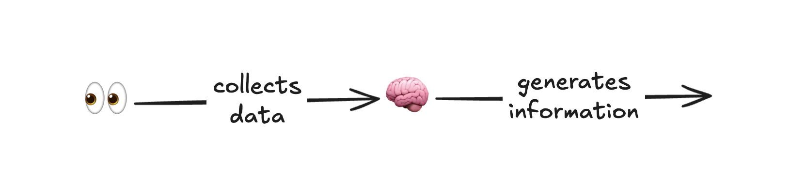
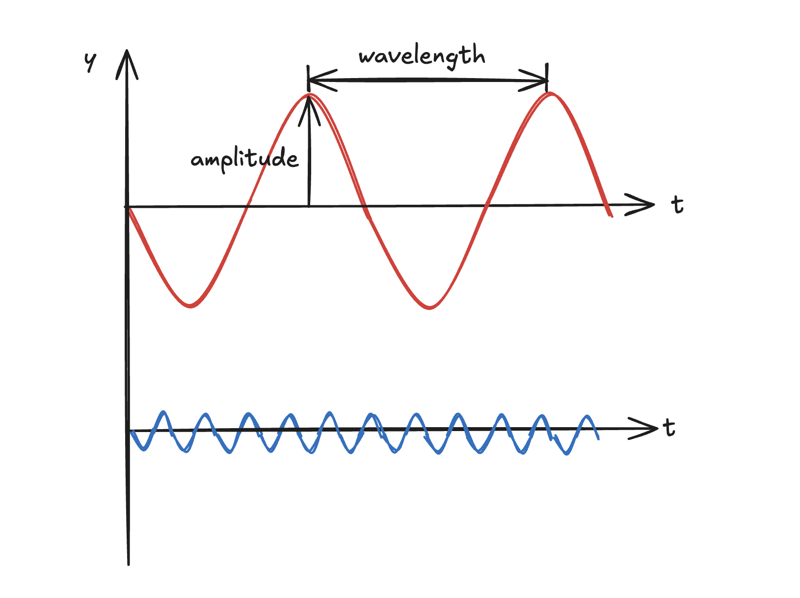
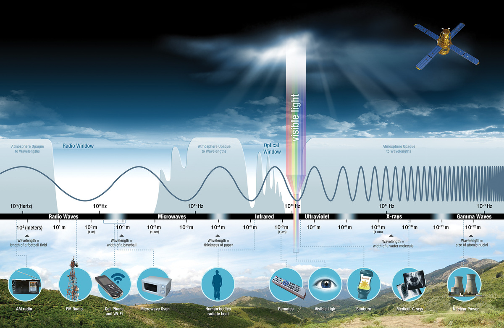

In this article we are going to explore one of the most interesting concepts of
remote sensing: the usage of **spectral signatures** for Earth's surface
classification. Spectral signatures are one of the basic concepts of satellite
data analysis, and are based on the particular response of each object to
radiation from the Sun. The goal of this article is to provide a simple enough
introduction to electromagnetic waves and to the spectral responses of common
Earth's surfaces, with simple examples from Sentinel-2 satellite data.

The article is accompanied by a
[repository](https://github.com/0xstepit/spectral-signatures) containing the
code used to retrieve the considered tile and create the images presented in the
practical section.

## What is Remote Sensing

Remote sensing (RS) is the art of collecting data about objects in a way that
the sensor used does not have to be in contact with the object itself. There are
multiple ways to detect objects properties far away from them, and in the
context of this article we are interested only in spaceborne solutions based on
satellites like the European Space Agency's (ESA) satellite Sentinel-2.

Two words used in the previous definition are of particular importance, **art**
and **data**. I intentionally used the word art because Earth Observation (EO)
with remote sensing involves intrinsic creative and artistic operations in the
development of satellite products. We will see later in these notes, that by
leveraging some basic concepts like RGB images and observations at different
frequencies, we are able to create wonderful representations of reality that
enable us to look at the invisible. The second term, data, is intentional too
(obviously) and refers to the fact that what satellite instruments observe are
pure numbers associated to physical phenomena, and it is the interesting part of
the game to manipulate this data to extract information in the form of imagery
products.

One big advantage of using remote sensing, which is the main reason why this
approach is the standard for EO, is that by using satellites, we are able to
monitor and collect data about places that would be hard or impossible for a
human to reach without complications, like vast oceans or dense forests. What we
can measure with RS instruments are called **geophysical parameters** and the
most common parameter measured is a form of energy called **electromagnetic
radiation**.

## Electromagnetic Radiation

Despite the name sounding pretty scary if you didn't study physics,
ElectroMagnetic (EM) radiation is nothing but the light that we are so used to
see and talk about. This radiation is a form of energy that travels in the space
around us as waves composed by an electric and a magnetic field.

In the context of EO, we don't need to know how to solve the
[Wave equation](https://en.wikipedia.org/wiki/Wave_equation) or its analytical
solution known as
[D'Alembert's formula](https://en.wikipedia.org/wiki/D'Alembert's_formula), but
it is enough to understand which properties characterize an EM wave and what
happens when the wave interacts with an object.

An EM wave motion can be described in terms of three properties:

- **Frequency $\nu$**: describes the number of cycles that pass through a point
  in a given unit of time. Cycles are described in terms of crests and troughs.
- **Wavelength $\lambda$**: is the distance after which the wave repeats itself.
- **Amplitude $A$**: is the measure from the rest position to the top of the
  crest or the bottom of the trough.

Each wave travels at the speed of light $c$, and this constant couples together
the first two properties with the formula:

$$
\nu = \frac{c}{\lambda}
$$

Another important property of the wave is its **polarization**, which describes
the orientation of the electric field as the wave propagates. The electric and
magnetic fields are always perpendicular to each other and to the direction of
travel. When the electric field oscillates in a fixed plane, we say the wave is
linearly polarized. When you buy polarized sunglasses you are basically getting
a tool to block waves whose electric field oscillates on a specific plane,
reducing this way eye strain and fatigue.

Having described the wave "geometrically", the next important concept is what
happens when it interacts with a surface. There are 5 modes of interaction:

- **Reflection**: the wave bounces off the body at an angle equal and opposite
  to the incidence angle.
- **Absorption**: the wave is absorbed and stored in the body.
- **Scatter**: the wave is redirected in many different directions, by how much
  depending on the wavelength (shorter wavelengths are scattered more strongly).
- **Emission**: the body emits energy itself.
- **Transmission**: the wave passes through the body that is transparent to that
  specific wavelength.

Which mode is manifested during the interaction strongly depends on the
wavelength of the interacting radiation. We can represent and categorize
radiation based on these properties in a diagram called **EM spectrum**:

Surprisingly, the diagram makes it clear that we, as humankind, are mostly
blind: the visible light our eyes can perceive spans only a tiny slice of the
whole electromagnetic spectrum.

As mentioned before, EM waves are nothing but a form of energy, and the energy
contained within them is $\propto \nu$, or alternatively $\propto 1/\lambda$.

In RS, different $\lambda$ are used based on the purpose of the observation:

- Radio waves are used to measure atmospheric humidity, cloud types, wind speed
  and direction, and precipitations. Radio waves, and also microwaves, are used
  with clouds because they are able to pass through the suspended water droplets
  and ice crystals.
- Microwaves are used to track global weather patterns.
- Infrared light is used to monitor the health of vegetation and the soil
  composition.
- Visible light is used to measure water features, soil, phytoplankton,
  atmospheric trace gases and aerosol.
- Ultraviolet light is used to measure ozone and air quality.

So, almost every wavelength has its application in observing the Earth. The
waves that are not used are the x-rays and gamma rays, luckily I would also add.
The reason that they are not used is that our atmosphere does a great job of
protecting our lives and is almost completely opaque to these wavelengths,
preventing them from reaching Earth's surface.

The source of EM waves that we are mostly concerned with is the Sun, whose
radiation is mainly distributed in the optical range, between roughly
$0.3\,\mu m$ and $3\,\mu m$, with the peak around $0.5\,\mu m$.

## Spectral Responses

We already mentioned that when radiation interacts with the surface of a body,
different modes of interaction can happen. The mode that manifests is not only
related to $\lambda$, but also to the physical properties of the surface! For
this reason, the spectral response, i.e. the radiation returned after the
interaction, is an almost unique characteristic of the medium and is called the
**spectral signature**. Despite each specific object having a unique spectral
signature, like each human has a specific fingerprint, objects belonging to
similar classes manifest similar responses. Scientists take advantage of it to
classify what is present on a specific area leveraging radiance measurements.
The **radiance** is the measure of the EM radiation leaving an object (whether
reflected or emitted) per unit area, per unit solid angle, and at a specific
frequency. Another important term is the **reflectance**, which is the
dimensionless measure given by the ratio between the reflected and incident
radiation. Please, notice that given the formula above, we can use frequency and
wavelength interchangeably.

### Common Spectral Signatures

Scientists identified these main spectral signatures:

- **Vegetation**: in the visible spectrum, the maximum of the reflectance is on
  the green wavelength but has the highest reflectance in the NIR region.
  Chlorophyll absorbs red and blue light for photosynthesis, which explains the
  low reflectance in those bands and the green color. The high NIR reflectance
  instead is because plants cannot use NIR photosynthetically and reflect it
  rather than absorbing it.
- **Soil**: it is not very reflective in any range but the reflectance increases
  with the increase in the wavelength. Carbon content and minerals can be
  identified and estimated in the visible and SWIR range since they have a
  different reflectance. When there is moisture on the soil, the reflectance in
  the NIR range decreases.
- **Water**: in the visible range it absorbs more at longer wavelengths and
  reflects more at the shorter ones. For this reason water appears blue to our
  eyes. Water with a lot of chlorophyll tends to have high reflectance in the
  green band too. Reflectance is very low also in the NIR.
- **Ice and snow**: have high reflectance in the entire visible range, and also
  in the NIR, but lower. Reflectance is low in the SWIR.
- **Atmosphere**: here we have to distinguish between clouds and trace gases.
  Clouds are very reflective in the visible and absorb a lot in the infrared. It
  is important to notice that clouds and gases reflect both when the radiation
  is directed to the Earth, and also when from Earth it reaches the sensors on
  the satellites. This is called **atmospheric interference**.

When designing a RS mission, engineers have the task of optimizing sensors'
characteristics in order to detect the specific spectral signatures the
scientific research needs. It is important to notice that due to the many
phenomena that happen before radiance is measured by the sensor, surface
instrument measurements will often not exactly match the satellite measurements.

## Practical Examples

In this section we will visually apply the concepts associated with the spectral
signatures to a specific region close to the Alps by using Sentinel-2 data.

Before plotting the values of the reflectance for the selected bands, a quick
pre-processing of the data has been performed. In particular, all bands have
been resampled to match the $10\,m$ resolution, and all the values have been
rescaled to the range $[0, 1]$, where $0$ is associated with the $2^{nd}$
percentile of the band and $1$ with the $98^{th}$. This simple approach allows
us to obtain more pleasant-looking images by avoiding the squashing of the
reflectance values into narrow ranges, a situation that can happen when elements
with very high reflectance are present, like clouds, or in the presence of
outliers. In this analysis, since we intentionally selected an image with
clouds, we also filtered their pixels out when they were not part of the feature
being visualized, allowing us to fully leverage the colormaps for only the
feature we wanted to observe.

For the analysis, a snapshot of the Alps close to Liechtenstein has been
selected, since it allowed us to investigate multiple surfaces and object types
in a single image. You can get the selected scene in the
[Copernicus Browser](https://link.dataspace.copernicus.eu/yzb6).

The first image we can generate is the so called **True Colors** image, in which
the bands associated with the red, green, and blue frequencies are used. With
these bands combination we obtain an image that appears very closely to how it
would be with our eyes.

")

As we can see, the image contains multiple Earth surface types like water,
vegetation, mountains, and clouds.

### Vegetation & Water

For the vegetation signature, we can start by plotting the single band image for
each of the visible wavelength. As expected, the regions of the image in which
we know that there is grass reflect more in the green band than in the red and
blue. This is highlighted by a brighter grey in the images. It is also
interesting to note that open grass fields are more reflective than forested
parts, where bigger trees create more complex responses and appear darker.

")

From the theory, we know that vegetation is actually more characterized by its
activity in the NIR range. This is because the green reflectance is only a local
maximum in the entire spectral range.

")

With the NIR image we can clearly distinguish water from vegetation, which was
not that easy to do using the visible bands.

Another very common approach used in the characterization of vegetation, and in
particular, on its health condition, is the usage of a **False Colors** image.
In these kind of images, the channels are combined in the same way as for a
classic RGB one, but at least one of the bands used is in the non-visible part
of the spectrum. Let's see what happens when we use the NIR instead of the red,
and shift the visible bands to the right:

 image of the Alps (Liechtenstein)")

Land cover of vegetation type appears bright red since it reflects strongly in
the NIR. Healthy, dense vegetation shows up as a vivid red, while stressed or
sparse vegetation appears darker and duller, providing information about the
plants' health status.

Water signatures are also clearly visible in the false-color image since their
reflectance is very low in the NIR range, and the dark spots stand out in this
type of image.

### Soil

For the soil, we can exploit the fact that its reflectance increases with the
wavelength, and plot different images with increasing values of the wavelength:

")

As expected, the scene gets progressively brighter moving from the blue band to
the SWIR1 band: bare and dry land reflects the most in the SWIR, where it
clearly stands out, while water stays almost completely black across all three
bands.

### Ice and Snow

Ice and snow are not that easy to identify with single-band images. One common
approach to highlight them is to use a false-color image based on the blue,
SWIR1, and SWIR2 bands. The rationale is that snow and ice are highly reflective
in the visible range (here the blue band) but strongly absorb in the SWIR,
whereas the SWIR behaviour differs between liquid-water and ice clouds:

 image of the Alps (Liechtenstein)")

As we can see, we are now able to identify objects that were completely
invisible in the previous images. On the lower left of the image we can clearly
see ice, exactly in the location of the
[Vorab Glacier](https://en.wikipedia.org/wiki/Vorab_Glacier). Other red spots
are present too, probably associated with the tips of other mountains. It is
also very interesting how we can clearly distinguish water clouds from iced
ones. Clouds made of water droplets are represented with a white/peach color,
while those containing ice particles have a more orange tone.

### Atmosphere

Regarding the atmosphere signatures, we can clearly see from almost all the
images where clouds are covering the Earth's surface, since they have very high
reflectance in the visible bands. Unfortunately, however, with Sentinel-2 images
we are not able to analyze the spectral signature of the trace gases.

## References

1. [Fundamentals of Remote Sensing](https://arset.unhosting.site/course/view.php?id=26)
1. [Why is that Forest Red and that Cloud Blue? How to Interpret a False-Color Satellite Image](https://science.nasa.gov/earth/earth-observatory/how-to-interpret-a-false-color-satellite-image/)
